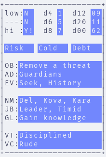

# ASCII Game Master

A riff on the game master apprentice, but in ascii mode. 

## Quick Start

To generate run:

```sh
brew install uv
uv sync
mkdir cards
uv run generate.py
```

## Usage

```py
from ascii_gm.text_generator import generate_text
from ascii_gm.oracle_data import gen_data
from ascii_gm.ascii_png import create_card

card_text = generate_text("card", gen_data)
create_card(card_text, f"card.png")
print(card_text)
```

```
+────────────────────+
│low:N   d4 1  d12 09│
│---:N   d6 5  d20 11│
│hi :Y!  d8 7  d00 62│
│                    │
│Risk   Cold   Debt  │
│                    │
│OB:Remove a threat  │
│AD:Guardians        │
│EV:Seek, History    │
│                    │
│NM:Del, Kova, Kara  │
│JB:Leader, Timid    │
│GL:Gain knowledge   │
│                    │
│VT:Disciplined      │
│VC:Rude             │
+────────────────────+
```

Example output



## Legend

**Likely Odds**

* `low`: Likely Odds (Likely) 
* `---`: Likely Odds (Even/50:50)
* `hi`: Likely Odds (Unlikely)

With allowable values being `Y` (Yes) `N` (No) with modifiers `!` (and...) and `?` (but...)

**Dice**

Self explanatory. `d00` is the `d100` with values from `00-99` similar to percentile dice interpret `00` as `100`.

**Event Generator**

Created from Ironsworn tables: `Action`, `Location Descriptors`, `Theme`.

**Quest Generator**

Created from One Page Solo Engine: `objective`, `adversaries`, `action focus`, `topic focus`. 

**NPC Generator**

Created from Ironsworn tables: `Ironlander Names`, `NPC Descriptors`, `Goals`.

**Virtue/Vice**

Created from Cairn character tables: `Virtue`, `Vice`.

## Tests

To run tests

```sh
uv run pytest ascii_gm/tests
```
